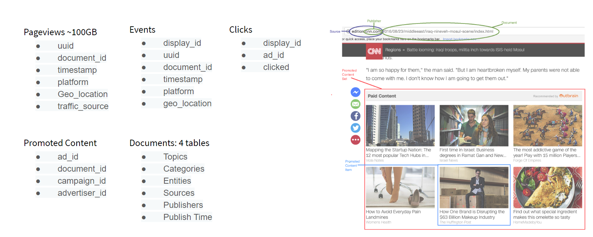
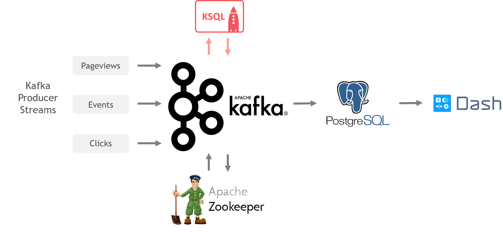
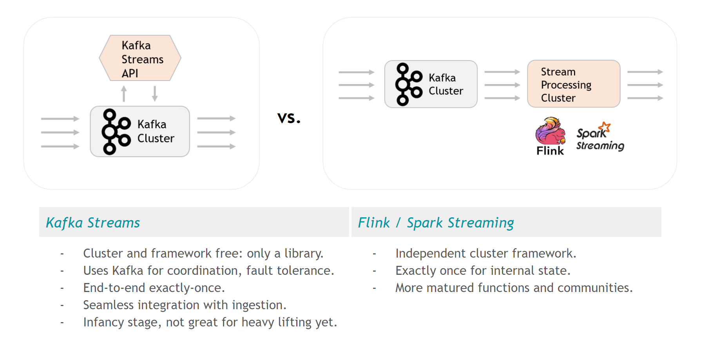

# AdMorphous: Ingestion and Stream Processing Integration with Kafka

In this project, I have utilized an API-style stream processing
framework on top of Kafka, integrating both ingestion and stream 
processing into a single framework to build a reactive and scalable pipeline for advertisements.  

The data used is the ["Outbrain Click Prediction"](https://www.kaggle.com/c/outbrain-click-prediction/data) data from Kaggle.  

  

## System Overview  

  

The system removes the sequential stream processing step after the ingestion, and integrates it into the Kafka framework.  
The following image depicts the pros and cons of using Kafka streams for this purpose.    

  

In this project, I have used Confluent's KSQL, a wrapper around Kafka streams for the stream processing.
It is a simple SQL-like language with a low learning curve, 
perfect for cases when the implementing functions are fairly simple, and developer time is limited.   

The repository is organized so that files of each part of the system are in their own directories. The parts are:  

- Producer  
- Kafka Cluster  
- KSQL  
- Connector  
- Database  
- Dashboard  

The overall system is deployed in Amazon Web Services (AWS), 
with each of the compartment installed in their own EC2 instance(s) Linux system.  

The streams of events are produced by Kafka producers that read the csv files and emits JSON files into the respective topics.    

In KSQL, two major calculations are done:    
- Count the number of views of each webpage every 10 minutes (windowed aggregation).    
- Join the streams of events and ads to be able to join the ad_id to each event, then count the number of impressions for each 
advertisement (join and aggregation).   

To be continued...

